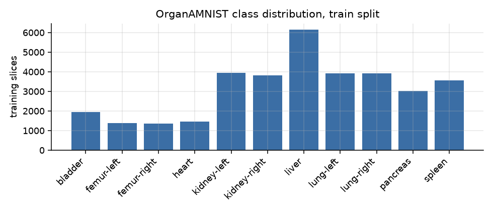
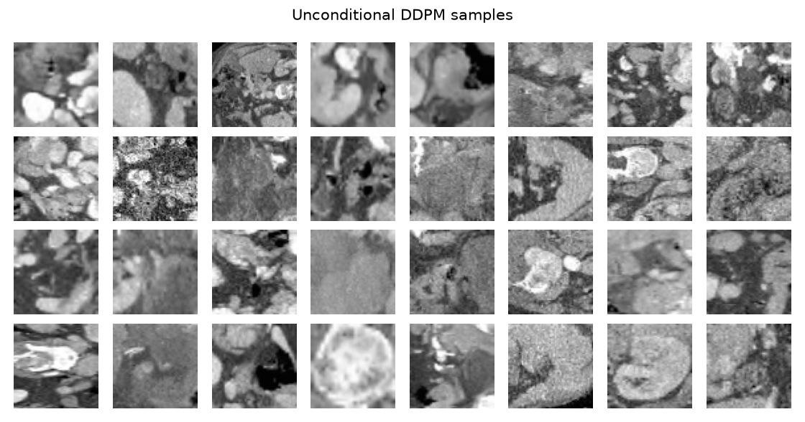
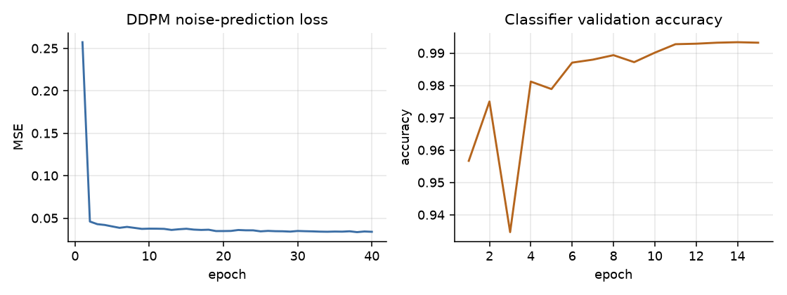
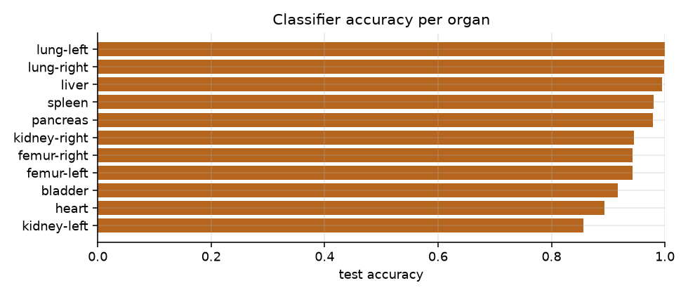
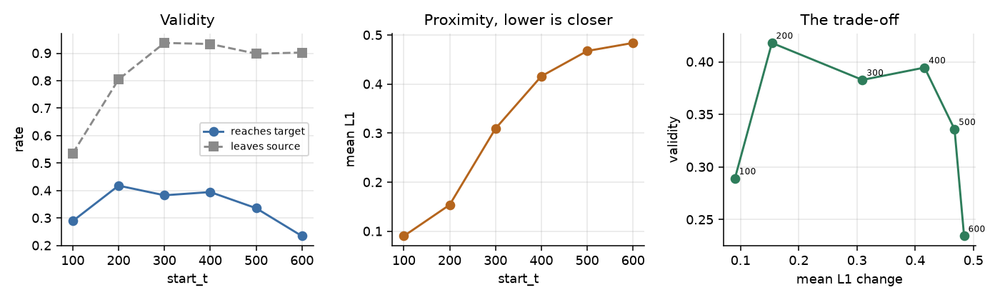
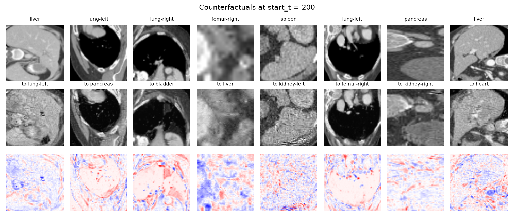
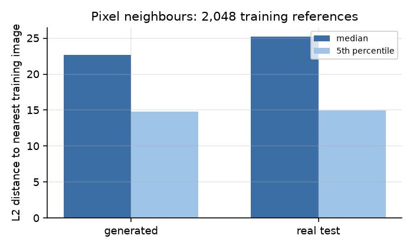

# Diffusion Counterfactuals for CT Organ Classification

A denoising diffusion model trained on abdominal CT, used to generate
counterfactual explanations for an organ classifier, with quantitative
evaluation of the generated counterfactuals.

---

## 1. Goal

A counterfactual explanation is the smallest edit to an image that changes a
classifier's decision. For a slice the model labels "liver", the counterfactual
is the nearest image the model labels "spleen". The quality of the explanation
depends on where the edit lands and how much of the original image survives.

This project implements classifier-guided diffusion counterfactuals on CT and
measures three things:

1. Whether a diffusion model trained on 34,561 CT slices generates
   counterfactuals that change the classifier's decision.
2. How validity, proximity and identity preservation vary with the depth of the
   forward noising step.
3. Whether the generative model reproduces its training images.

---

## 2. Data

OrganAMNIST from MedMNIST v2, 64x64 release. Axial abdominal CT slices cropped
to 11 organ classes, derived from the Liver Tumor Segmentation Benchmark.

| Property | Value |
|---|---|
| Source | [MedMNIST v2](https://medmnist.com/), CC BY 4.0 |
| Modality | Axial abdominal CT |
| Resolution | 64 x 64, single channel |
| Train / val / test | 34,561 / 6,491 / 17,778 |
| Classes | 11 organs |
| Scaling | uint8 mapped to [-1, 1] |

### Class distribution



The training split is imbalanced: liver has 6,164 slices, femur-left has 1,390.
Per-class classifier accuracy is reported in Section 4.3.

---

## 3. Method

### 3.1 Diffusion model

MONAI `DiffusionModelUNet`, 10.4M parameters, channel widths (64, 128, 192),
two residual blocks per level, self-attention at the coarsest resolution. The
network predicts the noise added at timestep `t` under a DDPM schedule with
T = 1000. Trained for 40 epochs at batch size 512 in bfloat16.

### 3.2 Classifier

Four-stage convolutional network over 64x64 slices with 11 outputs. This is the
model being explained. Dropout is retained so the network can also be used for
uncertainty estimation.

### 3.3 Counterfactual generation

For a slice `x0` with source label `y` and target label `y'`:

1. Noise `x0` forward to timestep `start_t`.
2. Denoise with DDIM over 100 steps.
3. At each step, compute the predicted clean image `x0_hat`, take the classifier
   gradient with respect to `x0_hat`, and subtract it from the noise prediction
   scaled by the guidance weight.

The gradient is taken on `x0_hat` because the classifier was trained on clean
slices and has not seen partially noised latents.

`start_t` controls the trade-off between changing the prediction and preserving
the image. Section 4.4 sweeps it.

### 3.4 Evaluation

| Axis | Measure |
|---|---|
| Validity | fraction where the classifier predicts the target class |
| Proximity | mean L1 change, and fraction of pixels moved more than 0.1 |
| Identity | centred cosine similarity between original and counterfactual |
| Realism | Frechet distance in classifier feature space |

A memorisation check computes the nearest-neighbour L2 distance from generated
samples to the training set, with the same statistic for real held-out test
images as a control.

---

## 4. Results

### 4.1 Diffusion samples



Unconditional samples after 40 epochs.

### 4.2 Training



Noise-prediction MSE fell from 0.096 to 0.034 over 40 epochs, 23 minutes on one
A100.

### 4.3 Classifier accuracy

Overall test accuracy 95.8%.



| Organ | Accuracy | Organ | Accuracy |
|---|---|---|---|
| heart | 0.885 | pancreas | 0.976 |
| kidney-left | 0.899 | spleen | 0.982 |
| femur-left | 0.946 | liver | 0.992 |
| kidney-right | 0.946 | lung-right | 0.999 |
| bladder | 0.952 | lung-left | 1.000 |
| femur-right | 0.968 | | |

### 4.4 Effect of noising depth

Evaluated on 256 test slices, on which the classifier achieves 0.934 accuracy.

| `start_t` | Validity | L1 change | Pixels changed | Identity |
|---|---|---|---|---|
| 50 | 0.086 | 0.054 | 0.162 | 0.981 |
| 100 | 0.301 | 0.090 | 0.344 | 0.950 |
| 150 | 0.387 | 0.114 | 0.424 | 0.923 |
| **200** | **0.426** | 0.155 | 0.546 | 0.866 |
| 300 | 0.375 | 0.305 | 0.777 | 0.602 |
| 400 | 0.398 | 0.422 | 0.851 | 0.335 |
| 600 | 0.219 | 0.481 | 0.876 | 0.079 |



Validity is non-monotonic in `start_t`. It rises to 0.426 at `start_t = 200` and
falls to 0.219 at `start_t = 600`. Over the same range, L1 change grows from
0.054 to 0.481 and identity correlation falls from 0.981 to 0.079.

At high `start_t` the guided denoising has enough freedom to leave the
neighbourhood of the original slice. At `start_t = 600` the procedure changes
88% of pixels and identity correlation is 0.079, so the output no longer
corresponds to the input slice.

Operating point used for the remaining experiments: the largest `start_t` at
which identity correlation exceeds 0.85 and validity has not begun to decline.
Both conditions select `start_t = 200`.

### 4.5 Counterfactual examples



Rows: original, counterfactual, difference. Generated at `start_t = 200`.

### 4.6 Single-slice inference

`src/infer.py` runs prediction and counterfactual generation on one test slice.


```
slice 7: truth lung-left, predicted lung-left at p=1.000
  counterfactual target lung-right at start_t=200
  now predicts lung-right (target p=0.716), flipped=True
  L1 0.1770  pixels changed 0.580  identity 0.914
```

The edit adds tissue-like texture to the air-filled lung field. Classifier
output moves from 1.000 on lung-left to 0.716 on lung-right with identity
correlation 0.914.

### 4.7 Memorisation



Nearest-neighbour L2 distance to the training set:

| Query set | n | Median | Minimum |
|---|---|---|---|
| Generated samples | 1,024 | 22.68 | 11.48 |
| Real test images | 310 | 25.22 | 10.71 |

Generated samples are 10% closer to the training set than real held-out images
(ratio 0.899). The closest generated sample is further from the training set
than the closest real test image. No training-image reproduction was detected.

### 4.8 Sample realism

Frechet distance in classifier feature space: 46.8 between generated samples and
training data, against 2.9 between real test images and training data.

---

## 5. Reproducing

### Requirements

```
torch  monai  medmnist  numpy  scipy  matplotlib  einops
```

One GPU. Full pipeline takes about 35 minutes on an A100. Data downloads on
first run, approximately 400MB.

### Pipeline

```bash
# 1. Diffusion model (23 min on an A100)
PYTHONPATH=src python src/train_diffusion.py --epochs 40 --batch-size 512

# 2. Classifier (4 min)
PYTHONPATH=src python src/train_classifier.py --epochs 15 --batch-size 256

# 3. Noising-depth sweep
PYTHONPATH=src python src/counterfactual.py --n 256 --scale 6.0 --steps 100

# 4. Sample quality and memorisation check
PYTHONPATH=src python src/evaluate.py --n-samples 1024 --steps 100

# 5. Single-slice inference
PYTHONPATH=src python src/infer.py --index 7

# 6. Figures
PYTHONPATH=src python src/figures.py
```

---

## 6. Repository layout

```
src/data.py               OrganAMNIST loaders
src/train_diffusion.py    DDPM training
src/train_classifier.py   organ classifier
src/counterfactual.py     guided generation and the start_t sweep
src/evaluate.py           Frechet distance and memorisation check
src/infer.py              single-slice inference
src/figures.py            figure generation
results/                  metrics as JSON
docs/figures/             figures
paper/                    IEEE-format technical report
```

---

## 7. Limitations

**Resolution.** 64x64 single slices, not full CT volumes. Chosen to keep the
pipeline within one GPU-day. Full-resolution work would require a latent
diffusion formulation and a more expensive counterfactual search. The numbers
here apply to this resolution only.

**Validity.** Peak validity is 0.426, so most counterfactuals do not reach the
target class. Some targets are unreachable within a fixed field of view. A
class-conditional diffusion model would likely improve on classifier guidance.

**Frechet distance.** Computed on organ-classifier features, not ImageNet
Inception features, because Inception is trained on natural photographs. The
value is comparable within this repository only and not against published FID
numbers.

**Task.** Organ identity is a proxy for a clinical label. Applying the pipeline
to a diagnostic target such as malignancy is the next step.

**Seeds.** The sweep was run once. Individual values carry sampling noise.

---

## 8. References

- Jeanneret et al., *Diffusion Models for Counterfactual Explanations*,
  [arXiv:2203.15636](https://arxiv.org/abs/2203.15636)
- Sanchez et al., *Counterfactual Explanations for Medical Image Classification
  and Regression using Diffusion Autoencoder*,
  [arXiv:2408.01571](https://arxiv.org/abs/2408.01571)
- Dar et al., *Unconditional Latent Diffusion Models Memorize Patient Imaging
  Data*, [arXiv:2402.01054](https://arxiv.org/abs/2402.01054)
- Ho et al., *Denoising Diffusion Probabilistic Models*, NeurIPS 2020
- Song et al., *Denoising Diffusion Implicit Models*, ICLR 2021
- Yang et al., *MedMNIST v2*, Scientific Data 10, 2023
