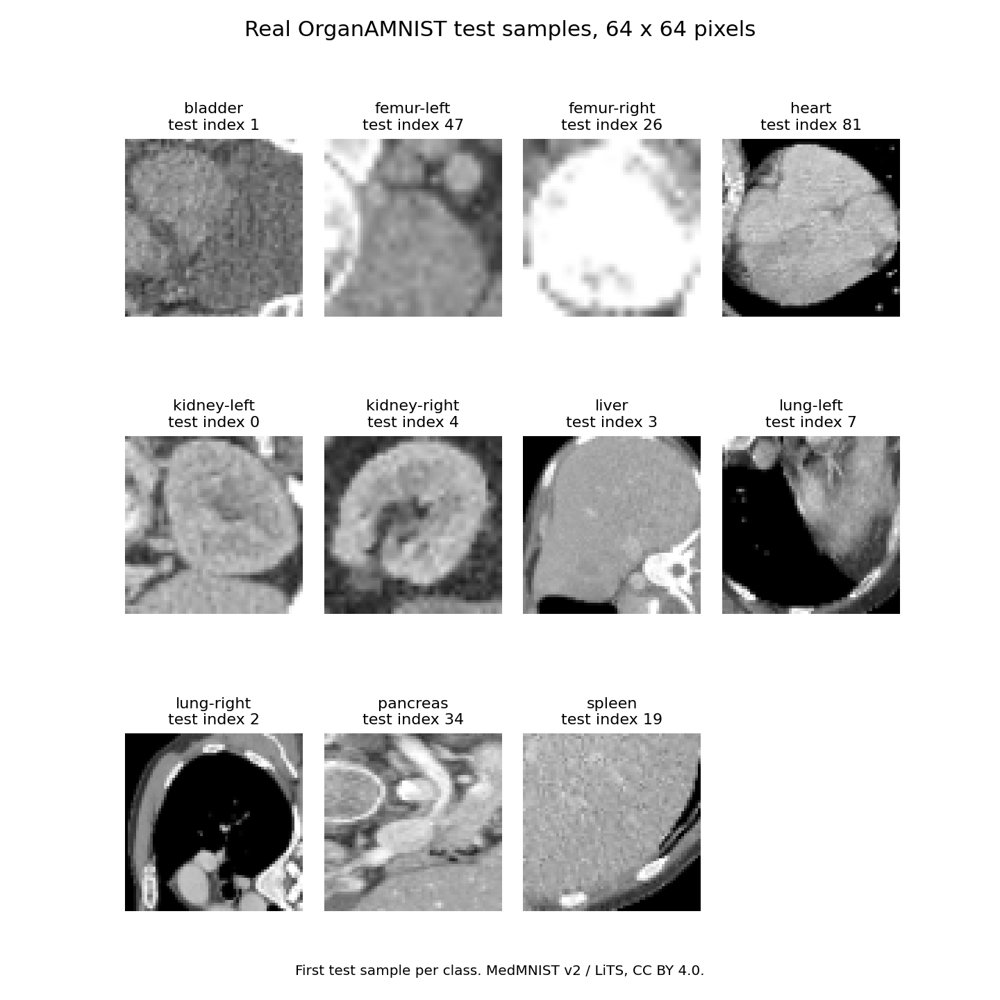

# CT Diffusion Counterfactuals

Can a diffusion model change an organ classifier's prediction while keeping the image close to its input? This project trains a small classifier and a DDPM on **64 × 64 CT-derived organ crops**, then measures that trade-off with classifier-guided sampling.

**Main finding:** target-class success improves at moderate noise levels, but larger image changes do not reliably improve success. Pixel similarity alone does not establish anatomical plausibility.

[📊 Results](docs/results.md) · [▶ Run it](docs/reproduce.md) · [🔍 Verification](docs/verification.md) · [Technical report](paper/diffusion_counterfactuals.pdf)

## What does the data look like?



These are **real benchmark inputs**, not generated images. Each is the first test example of its class. The [sample files and attribution](examples/README.md) are included, so readers can inspect the data without downloading the full dataset.

| Question | Answer |
|---|---|
| Data | OrganAMNIST, derived from LiTS through MedMNIST v2 |
| Task | 11-class organ recognition; a proxy task for counterfactual research |
| Train / validation / test | 34,561 / 6,491 / 17,778 slices |
| Input | Grayscale 64 × 64, scaled from uint8 to [-1, 1] |
| Models | OrganCNN classifier and an unconditional MONAI DDPM |
| Project contribution | Training, classifier-guided sampling, noise-level comparisons and evaluation |

[Data provenance and labels](docs/data.md) · [How the method works](docs/methods.md)

## What do the results support?

| Check | Result | Meaning |
|---|---|---|
| Classifier, all 17,778 test slices | **95.77% accuracy**, reproduced from the saved checkpoint | The classifier performs well on this organ benchmark |
| Original 256-image sweep, noise level 200 | **109/256 (42.58%)** reach their assigned target | One stochastic run, selected on the test subset |
| Seeded repeat, same images and level | **101/256 (39.45%)** reach the target | The exact success rate varies with sampling |
| Seeded repeat, noise level 150 | **102/256 (39.84%)** reach the target | One case more than level 200; no established optimum |
| Original level 200, mean image change | **L1 0.155; 54.6% of pixels change by >0.1** | Successful prediction changes can involve substantial edits |

The repeat includes one image already predicted as its assigned target before generation. It records **100 actual target flips** at level 200. [All noise levels, per-class scores and definitions](docs/results.md) are available alongside the raw results.

## Try it

Preview the included data on a CPU, with no model or dataset download:

```bash
git clone https://github.com/Joana-Mansa/ct-diffusion-counterfactuals.git
cd ct-diffusion-counterfactuals
python -m venv .venv
source .venv/bin/activate
pip install numpy matplotlib
python scripts/preview_data.py
```

Then follow the [reproduction guide](docs/reproduce.md) to download checked weights, generate one example, or repeat the evaluation.

## Scope and limits

- This changes **organ predictions**, not disease states or patient outcomes.
- No radiologist study, anatomical segmentation check or external clinical validation was performed.
- Noise-level selection used the test subset. The result is exploratory, not an independently validated operating point.
- Pixel nearest-neighbour checks cover a limited set of generated samples and do not prove absence of memorisation or patient privacy risk.

## Read further

| Resource | What it contains |
|---|---|
| [Methods](docs/methods.md) | Training, guided denoising and metric definitions |
| [Full results](docs/results.md) | Original experiment, seeded repeat and sample-quality limits |
| [Verification record](docs/verification.md) | What was rerun, what was only checked, and artifact hashes |
| [Technical report](paper/diffusion_counterfactuals.pdf) | Self-contained research report, not a peer-reviewed publication |
| [Source code](src/) | Training, generation, evaluation and figure scripts |

Data: [MedMNIST v2](https://medmnist.com/), CC BY 4.0. Models use [MONAI](https://github.com/Project-MONAI/MONAI). Related work: [Jeanneret et al.](https://arxiv.org/abs/2203.15636) and [Atad et al.](https://arxiv.org/abs/2408.01571). These methods and datasets are credited to their original authors.
