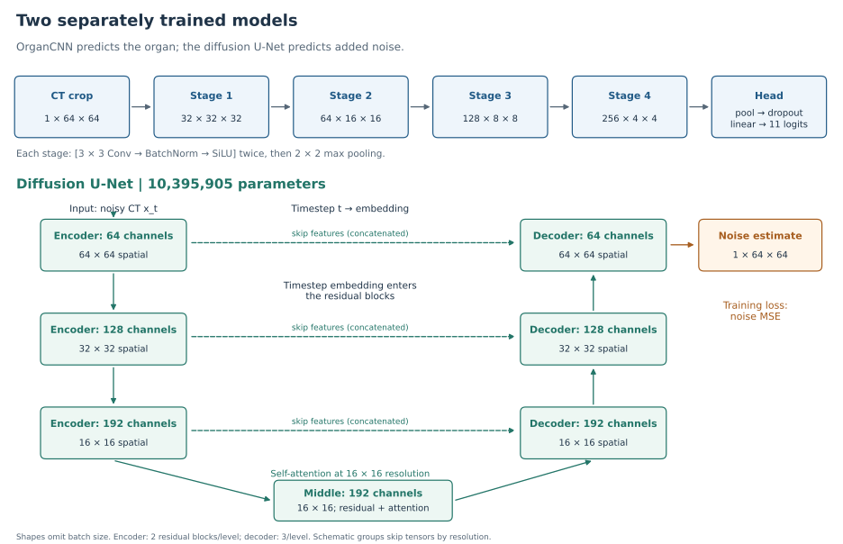
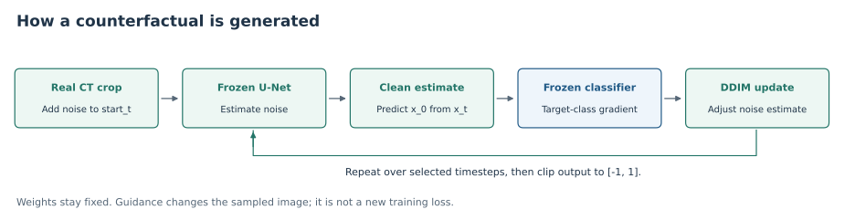
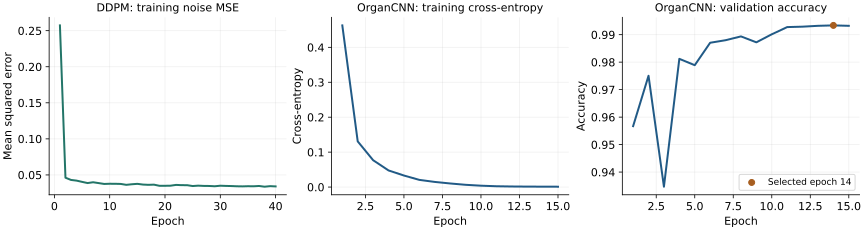

[Overview](../README.md) · [Methods](methods.md) · [Results](results.md) · [Run it](reproduce.md)

# Architecture and training objectives

## Read the diagram

A **feature map** is an intermediate array of learned image features. Shapes below are `channels × height × width`; batch size is omitted. A residual block adds a shortcut to its transformed features. U-Net skip connections concatenate earlier features into the decoder to retain spatial detail.

The U-Net drawing groups skip tensors by spatial resolution. It shows feature sizes before the next downsampling or upsampling operation, rather than every internal tensor. [Measured module outputs and parameter counts](../results/architecture.json) provide the more detailed runtime record.

## Organ classifier: 1,176,427 parameters

| Component | Operation | Output shape |
|---|---|---|
| Input | Float image in [-1, 1] | 1 × 64 × 64 |
| Stage 1 | Two 3 × 3 Conv / BatchNorm / SiLU blocks, then 2 × 2 max pool | 32 × 32 × 32 |
| Stage 2 | Same block pattern | 64 × 16 × 16 |
| Stage 3 | Same block pattern | 128 × 8 × 8 |
| Stage 4 | Same block pattern | 256 × 4 × 4 |
| Pool | Global spatial average | 256 |
| Dropout | Probability 0.2 during training | 256 |
| Linear | 256 inputs, 11 outputs | 11 logits |

Logits are unnormalised class scores. Softmax converts them to probabilities when needed. Training passes logits directly to PyTorch cross-entropy, which performs the appropriate log-softmax internally.

For a batch of size $B$, organ label $y_i$ and predicted probability $p_i$:

$$
\mathcal{L}_{\mathrm{organ}}=-\frac{1}{B}\sum_{i=1}^{B}\log p_i(y_i).
$$

This loss penalises low probability assigned to the correct organ. It does not measure explanation quality. The script uses AdamW, learning rate 0.001, weight decay 0.0001, cosine decay and batch size 256 by default. The recorded run has 15 epochs; highest validation accuracy selects its checkpoint. [Source](../src/train_classifier.py) · [History](../results/classifier.json).

## Diffusion U-Net: 10,395,905 parameters

| Component | Configuration |
|---|---|
| Input/output | Noisy one-channel 64 × 64 image / same-size noise estimate |
| Channel widths | 64, 128, 192 at spatial scales 64², 32², 16² |
| Residual blocks | 2 per encoder level; 3 per decoder level |
| Attention | Coarsest 16² level and middle block; 64 channels per attention head |
| Time conditioning | Timestep embedding passed into residual blocks |
| Normalisation / activation | GroupNorm / SiLU in diffusion residual blocks |
| Skip connections | Concatenate stored encoder features into decoder blocks |
| Conditioning on organ labels | None during DDPM training; classifier guidance is a later sampling step |

Given a clean image $x_0$, sampled Gaussian noise $\epsilon$ and timestep $t$, the scheduler constructs:

$$
x_t=\sqrt{\bar\alpha_t}\,x_0+\sqrt{1-\bar\alpha_t}\,\epsilon.
$$

The network predicts the added noise, $\epsilon_\theta(x_t,t)$, and minimises the mean over batch, channel and pixel elements:

$$
\mathcal{L}_{\mathrm{noise}}=\operatorname{mean}\left[(\epsilon_\theta(x_t,t)-\epsilon)^2\right].
$$

This is **noise MSE**, not an image reconstruction, adversarial or anatomical loss. Training uses random timesteps from a 1,000-step schedule. The saved experiment ran 40 epochs, batch size 512, learning rate 0.00025 and bfloat16 autocasting. It saves the final epoch; no validation diffusion loss was logged. CLI defaults differ, so the [training command](reproduce.md) supplies the recorded settings explicitly. [Source](../src/train_diffusion.py) · [History](../results/diffusion_training.json).

## Guided sampling uses fixed model weights

At each selected DDIM timestep, the U-Net predicts noise. The code derives a clean-image estimate, evaluates the frozen classifier on its clipped version, and differentiates the target log-probability with respect to that estimate. It then adjusts the noise estimate:

$$
g=\nabla_{\hat x_0}\log p_\phi(y_{\mathrm{target}}\mid\operatorname{clip}(\hat x_0,-1,1)),\qquad
\epsilon_{\mathrm{guided}}=\epsilon_\theta-s\sqrt{1-\bar\alpha_t}\,g.
$$

Here $s=6$ in the recorded sweep. DDIM uses this adjusted estimate for its next image update. The gradient follows this code's clean-estimate formulation; it is not a claim of an exact conditional sampler. Neither network's weights are updated during generation.

**L1 distance, changed-pixel fraction and image correlation are measured afterward.** They are not explicit proximity penalties in the implemented optimisation, and no minimum-edit guarantee is established. [Implementation](../src/counterfactual.py).

## Read the learning curves

The curves are rendered directly from saved JSON. They are neither simulated nor smoothed. Training losses decrease, but low loss alone does not establish realism, generalisation or faithful explanations. Validation accuracy selects the organ classifier; the DDPM plot contains training loss only. No unrecorded validation-loss curve is invented.

Regenerate all drawings and plots with `python scripts/architecture_figures.py`. These are architecture schematics, not new experiments.
