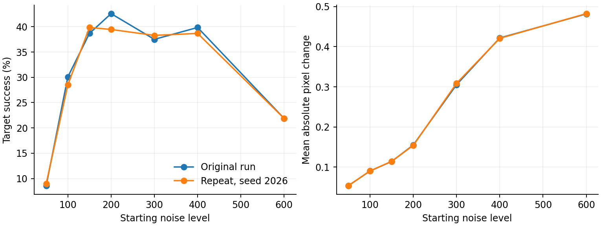
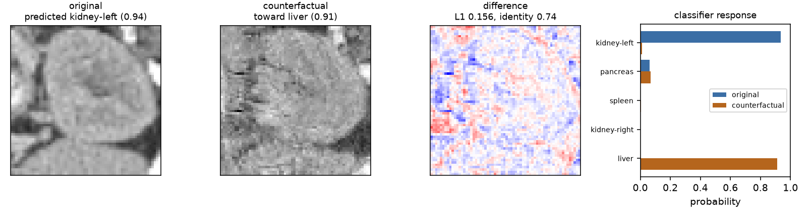

[Overview](../README.md) · [Data](data.md) · [Methods](methods.md) · [Results](results.md) · [Run it](reproduce.md) · [Verification](verification.md)

# Results

## Classifier

Re-evaluation of the saved checkpoint on all 17,778 test slices reproduced **95.7701% accuracy** and every saved per-class score. Validation accuracy in the training record is 99.3375%.

| Organ | Test accuracy |
|---|---:|
| bladder | 91.70% |
| femur-left | 94.26% |
| femur-right | 94.33% |
| heart | 89.30% |
| kidney-left | 85.61% |
| kidney-right | 94.55% |
| liver | 99.54% |
| lung-left | 100.00% |
| lung-right | 99.89% |
| pancreas | 97.90% |
| spleen | 98.04% |

## Counterfactual sweep and seeded repeat

Same 256 images, target assignment, checkpoints, 100-point DDIM grid and guidance scale 6. The original sampling RNG was not recorded. The repeat uses PyTorch seed 2026. These two runs describe sampling variability, not independent cohorts.

| Noise level | Executed updates | Original target success | Repeat target success | Repeat actual target flips | Original mean L1 | Original changed pixels |
|---|---:|---:|---:|---:|---:|---:|
| 50 | 6 | 22/256 (8.59%) | 23/256 (8.98%) | 22 | 0.0537 | 16.2% |
| 100 | 10 | 77/256 (30.08%) | 73/256 (28.52%) | 72 | 0.0904 | 34.4% |
| 150 | 15 | 99/256 (38.67%) | 102/256 (39.84%) | 101 | 0.1141 | 42.4% |
| 200 | 20 | 109/256 (42.58%) | 101/256 (39.45%) | 100 | 0.1551 | 54.6% |
| 300 | 30 | 96/256 (37.50%) | 98/256 (38.28%) | 98 | 0.3052 | 77.7% |
| 400 | 40 | 102/256 (39.84%) | 99/256 (38.67%) | 98 | 0.4217 | 85.1% |
| 600 | 60 | 56/256 (21.88%) | 56/256 (21.88%) | 56 | 0.4814 | 87.6% |

At level 200, 93 of the 239 originally correct inputs reach the assigned target in the repeat (38.91%). The headline 101/256 includes originally misclassified inputs and one input already predicted as target. Level 150 has only one more target success than level 200. These experiments support a trade-off region, not a stable optimal noise level.

The plot uses the original JSON and the new verification record. Larger L1 means larger edits in normalised pixel units; it is not an anatomical assessment.

## Generator training and sample quality

Recorded DDPM training MSE falls from **0.25735** at epoch 1 to **0.03404** at epoch 40. This is training loss, not a held-out generative-quality score.

The original quality record reports classifier-feature Fréchet distances of **46.84** (generated versus train) and **2.89** (real test versus train). Both values were reproduced from saved generated images. This is not standard ImageNet FID and does not independently validate anatomical realism.

Although `samples.pt` exposes a 64-image view, PyTorch saved its complete backing storage of **1,024 images**. All 1,024 were recovered, the first 64 matched the visible tensor exactly, and the full array is now explicitly published as [generated_samples.npz](../results/generated_samples.npz). The original sample-quality and nearest-neighbour statistics were reproduced from these images and the same deterministic reference selection.

| Pixel nearest-neighbour comparison | Generated median L2 | Real-test median L2 | Reference pool |
|---|---:|---:|---|
| Original protocol, reproduced with 1,024 generated and 1,024 real images | 22.68 | 25.22 | 2,048 sampled training slices |
| Extended check, same 1,024 generated and 1,024 real images | 21.31 | 23.60 | All 34,561 training slices |

The generated median is **lower**, not higher, than the real-test median. None of these 1,024 generated images has zero pixel distance to the complete training pool; the minimum is 10.40. This does not rule out near-copying, memorisation in other model outputs, or patient-level leakage. [Recomputed quality and full-pool statistics](../results/sample_quality_verification.json).

## Inspect one generated candidate

The documented command uses test index 0, target liver, noise level 200 and seed 2026. The original kidney-left prediction changes to liver, with target probability 0.911, L1 0.156 and image correlation 0.735. This is a successful model-target example with substantial image changes, not evidence of a plausible anatomical intervention. [Exact output](../results/inference_example.json).

## Evidence files

- [Original classifier](../results/classifier.json), [training history](../results/diffusion_training.json), [original sweep](../results/counterfactual_sweep.json), [original quality record](../results/sample_quality.json)
- [Recomputed checkpoint metrics and seeded repeat](../results/verification.json)
- [Per-case indices, targets, predictions and L1 values](../results/counterfactual_replication.npz)

[Verification scope](verification.md) describes what was and was not rerun. No anatomical or clinical validity claim is supported by these results.
